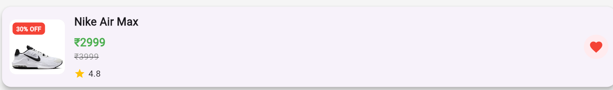
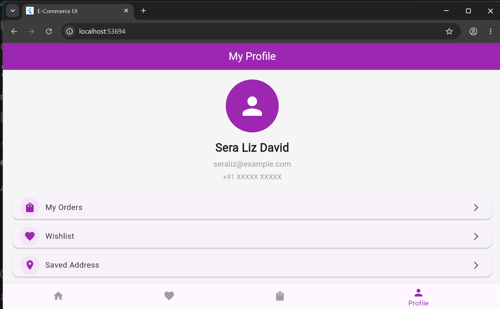
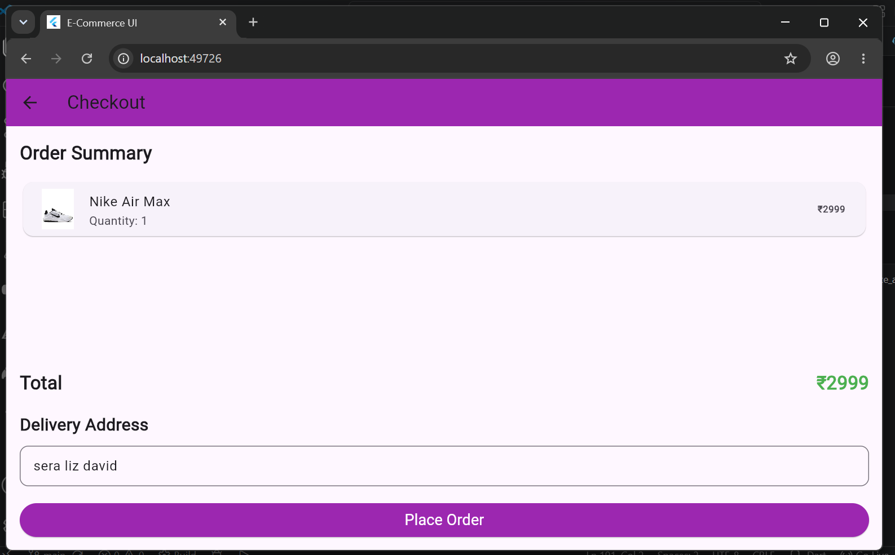
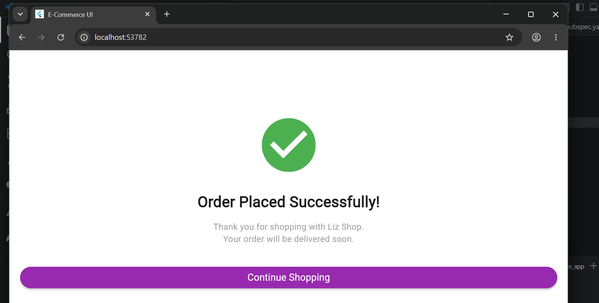
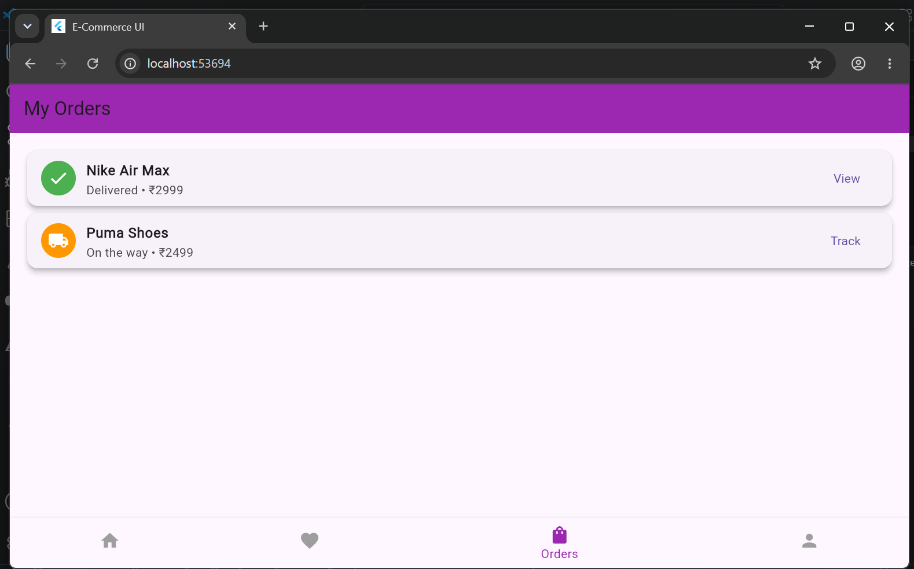

# 🛍️ Liz Shop - Flutter E-Commerce App

A modern Flutter e-commerce application built with clean UI and Firebase integration. This project is developed as part of my Flutter learning journey and portfolio.

## ✨ Features

- 🛒 Shopping Cart
- ❤️ Wishlist
- 🔍 Product Search
- 📂 Product Categories
- 👤 User Profile
- 💳 Checkout Screen
- 📱 Responsive UI
- 🔥 Firebase Authentication (In Progress)
- ☁️ Cloud Firestore (In Progress)

## 🛠️ Tech Stack

- Flutter
- Dart
- Firebase
- Git & GitHub

## 📸 Screenshots

> Screenshots will be added after completing the project.

## 🚀 Getting Started

### Prerequisites

- Flutter SDK
- Android Studio / VS Code
- Dart SDK

### Installation

```bash
git clone https://github.com/sera-liz/e_commerce_app.git
```

```bash
cd e_commerce_app
```

```bash
flutter pub get
```

```bash
flutter run
```

## 📌 Project Status

🚧 Currently under development.

Completed:
- ✅ UI Design
- ✅ Navigation
- ✅ Shopping Cart
- ✅ Wishlist

Upcoming:
- 🔥 Firebase Authentication
- ☁️ Cloud Firestore
- 📦 Order History
- 💳 Checkout Integration

## 👩‍💻 Developer

**Sera Liz David**

- GitHub: https://github.com/sera-liz
- LinkedIn: www.linkedin.com/in/sera-liz-david-6842a8327

---

⭐ If you like this project, feel free to star the repository!
## 📸 Screenshots

### 🏠 Home Screen


### ❤️ Wishlist



### 👤 Profile



### 🛒 Checkout



### ✅ Order Success



### 📍 Order Tracking


